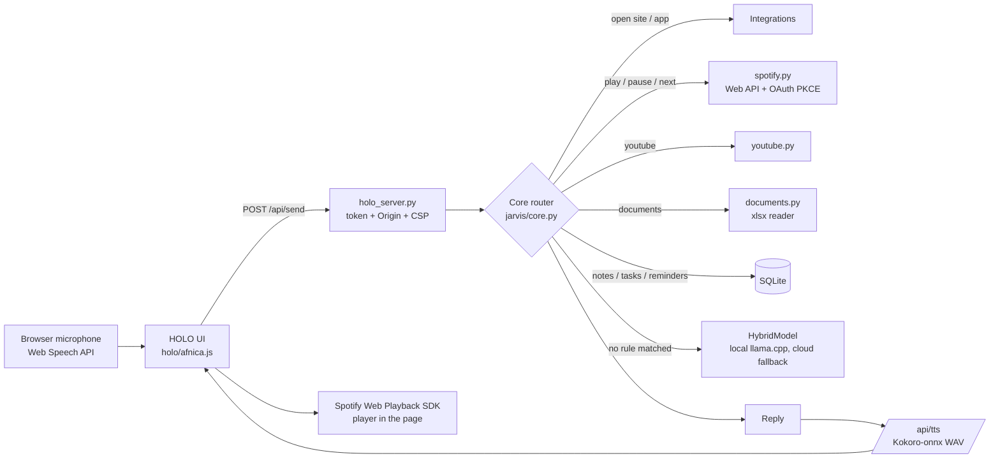

# A.I Assistant

[](https://github.com/alexfnica/ai-assistant/actions)


A local-first voice assistant with a holographic, Iron-Man-style browser interface.
It listens, answers in a natural British voice generated on the device, controls Spotify
and YouTube, reads business documents, and keeps notes, tasks and reminders. Built in
pure Python standard library (no runtime dependencies) and about 500 lines of vanilla JS.

<!-- Add a screenshot or a short GIF here: docs/img/hud.png -->

## Why it is built this way

- **Deterministic first, LLM second.** Commands ("play Back in Black", "open Shopify",
  "stop") go through a rule-based router in `jarvis/core.py`. A language model only
  answers what the router does not recognise, and generated text can never execute a
  command that changes data. This keeps the assistant fast, predictable and testable.
- **Local by default.** Speech synthesis (Kokoro-onnx) and the conversational model
  (Qwen2.5-1.5B via llama.cpp) run on the machine. A cloud model (Claude) is an optional
  fallback with a monthly token budget.
- **Secure by construction.** The local server binds to 127.0.0.1 only, requires a
  session token and Origin check, sends a strict Content-Security-Policy, and uses
  OAuth 2.0 authorization code + PKCE with a loopback redirect. Secrets are read from the
  environment or ignored files and never appear in logs.
- **Zero runtime dependencies.** `pip install` is not needed to run it.

## Architecture



More detail is in [docs/ARCHITECTURE.md](docs/ARCHITECTURE.md), [docs/EXTENDING.md](docs/EXTENDING.md)
and [docs/VALIDATION.md](docs/VALIDATION.md) (currently in Romanian, in `docs/ro/` for the rest of the guides).

## Notable engineering problems solved

| Problem | Solution |
| --- | --- |
| The microphone hears the assistant's own voice and the song | Overlap filter against the last spoken text, fresh recognizer session per command, per-result command extraction while music plays |
| Talking over the assistant must stop it | Barge-in detection plus a stop-phrase matcher that works even when speech is merged with echo |
| Spotify playback from a desktop app is unreliable | The page registers itself as a Web Playback SDK device and Core targets that device |
| "playback in Black" is misheard for "play Back in Black" | Text normalisation before routing, so it never reaches the LLM |
| Robotic TTS | Kokoro voice blends with pitch factor 1.0 (no resampling artefacts) and slight tempo adjustment |
| Spoken commands opened document lists instead of apps | Explicit precedence: sites/apps and music are matched before document opening |

## Features

- Voice commands in English (mixed Romanian input works for notes and documents).
- Spotify: play, pause, resume, next, previous, volume, by voice, in the Jarvis window.
- Open WhatsApp, Facebook, Instagram, Shopify, YouTube, Gmail, and more by voice.
- YouTube channel helpers and feedback.
- Excel document reading with per-sheet filtering.
- Notes, tasks, reminders in SQLite; morning briefing.
- Pluggable modules (`jarvis/modules/`): fishroom journal, jobs, game, YouTube, general.
- Hand-tracking holographic UI (Three.js, MediaPipe hands) with an Iron-Man HUD skin.

## Setup

Requirements: Python 3.11+, Chrome or Edge. Windows is the primary target
(some features use PowerShell and `os.startfile`); the router, storage and
tests run on any OS.

```bash
git clone https://github.com/alexfnica/ai-assistant.git
cd ai-assistant
python -m unittest discover -s tests        # 66 tests, no dependencies
python run_jarvis.py --holo                 # http://127.0.0.1:4891
```

Optional pieces (all git-ignored, see `data/*.example.json`):

- **Spotify / YouTube:** create a developer app, put the client id in
  `data/spotify.json` (and `data/youtube.json`), tick *Web Playback SDK*, then say
  "connect spotify". See [SETUP-YOUTUBE-SPOTIFY.md](SETUP-YOUTUBE-SPOTIFY.md).
- **Cloud model:** set `ANTHROPIC_API_KEY` (see `.env.example`).
- **Local voice and model:** place the Kokoro voice files and the llama.cpp runtime
  and GGUF model in `voice-natural-runtime/` and `llm/` (see
  [VOCE-NATURALA.md](VOCE-NATURALA.md), [CONVERSATIONAL-AI.md](CONVERSATIONAL-AI.md)).

## Autostart (Windows)

Run `Install-Autostart.cmd` once. It adds an **A.I Assistant** shortcut with its own icon to the
Startup folder and the Desktop, so the assistant opens by itself when you log in. Run
`Uninstall-Autostart.cmd` to remove it.

## Tests

```bash
python -m unittest discover -s tests -v
```

Covers command routing (English and Romanian), the Spotify flows with fake transports,
OAuth and token handling, the Kokoro service, the personality prompt, and a guarantee that
model output cannot trigger data-changing commands.

## Project layout

```
jarvis/        core router, integrations, server, TTS, storage (stdlib only)
jarvis/modules command modules
holo/          browser UI: HTML, CSS, JS (voice, HUD, Spotify player)
tests/         unittest suite
docs/          architecture, extension guide, validation notes
personality/   system prompt for the assistant persona
```

## Licence

MIT, see [LICENSE](LICENSE). Bundled third-party files in `holo/vendor/`
(Three.js, MediaPipe) keep their own licences. Model licences are under `llm/`.


